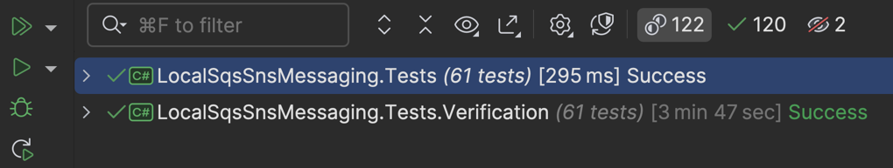

# LocalSqsSnsMessaging

[](https://www.nuget.org/packages/LocalSqsSnsMessaging "Download LocalSqsSnsMessaging from NuGet")
[](https://github.com/justeattakeaway/LocalSqsSnsMessaging/actions/workflows/build.yml)

## Overview

This .NET library is intended to provide a simple in-memory drop-in replacement for the AWS SDK for SQS and SNS, primarily for testing (but can be used for local development too).

## Why?

Why would you build this when LocalStack already exists, and is awesome?

One word: _Speed_ 🏎️️⚡⚡

While LocalStack is relatively quick, nothing is a replacement for in-memory operations, it means you can run your tests faster, and you can run them in parallel without worrying about port conflicts.

Don't take our word for it, here are our tests for this project at the time of writing, ran against this library and LocalStack (to verify correctness):


> [!TIP]
> The LocalStack tests above were ran with the default behaviour of xUnit, which is to not run tests in parallel when a test collection is used.
> You can speed up this sort of test suite by fighting against xUnit's defaults (see [Meziantou.Xunit.ParallelTestFramework](https://github.com/meziantou/Meziantou.Xunit.ParallelTestFramework) for example) and getting tests to run in parallel.
> LocalStack has feature where if you pass an access key that looks like an account id, it will use this account for any resources created, this can help isolate tests from each other allowing them to run in parallel.

Additionally, some tests rely on the passage of time, but now with .NET's [`TimeProvider`](https://learn.microsoft.com/dotnet/api/system.timeprovider) you can control time in your tests, and travel through time like it's 1985, Great Scott!

## Usage Modes

This library supports two modes of operation:

1. **Direct In-Memory Clients** (`CreateSqsClient()` / `CreateSnsClient()`) - Returns lightweight implementations of `IAmazonSQS` and `IAmazonSimpleNotificationService`
2. **SDK Clients with HttpMessageHandler** (`CreateSdkSqsClient()` / `CreateSdkSnsClient()`) - Returns real AWS SDK clients (`AmazonSQSClient` / `AmazonSimpleNotificationServiceClient`) configured with an in-memory HTTP handler

Use the SDK clients mode when you need concrete AWS SDK types (e.g., for dependency injection or libraries that require concrete types). Both modes share the same in-memory bus and are functionally identical.

## Examples

### Basic Usage (Direct In-Memory Clients)

Creating a topic, a queue, subscribing the queue to the topic, and sending a message to the topic, then receiving the message from the queue.

```csharp
using Amazon.SimpleNotificationService.Model;
using LocalSqsSnsMessaging;

var bus = new InMemoryAwsBus();
using var sqs = bus.CreateSqsClient();
using var sns = bus.CreateSnsClient();

// Create a queue and a topic
var queueUrl = (await sqs.CreateQueueAsync("test-queue")).QueueUrl;
var topicArn = (await sns.CreateTopicAsync("test-topic")).TopicArn;
var queueArn = (await sqs.GetQueueAttributesAsync(queueUrl, ["QueueArn"])).Attributes["QueueArn"];

// Subscribe the queue to the topic
await sns.SubscribeAsync(new SubscribeRequest(topicArn, "sqs", queueArn)
{
    Attributes = new() { ["RawMessageDelivery"] = "true" }
});

// Send a message to the topic
await sns.PublishAsync(topicArn, "Hello, World!");

// Receive the message from the queue
var receiveMessageResponse = await sqs.ReceiveMessageAsync(queueUrl);
var message = receiveMessageResponse.Messages.Single();

Console.WriteLine(message.Body); // Hello, World!
```

### Using Real AWS SDK Clients

For scenarios where you need the concrete AWS SDK client types:

```csharp
using Amazon.SQS;
using Amazon.SimpleNotificationService;
using LocalSqsSnsMessaging;

var bus = new InMemoryAwsBus();
using var sqs = bus.CreateSdkSqsClient();      // Returns AmazonSQSClient
using var sns = bus.CreateSdkSnsClient();      // Returns AmazonSimpleNotificationServiceClient

// Same API as direct clients
var queueUrl = (await sqs.CreateQueueAsync("test-queue")).QueueUrl;
await sqs.SendMessageAsync(queueUrl, "Hello from SDK client!");
var messages = await sqs.ReceiveMessageAsync(queueUrl);
```

### Time Travel

Creating a queue, sending a message to the queue with a delay, advancing time, and receiving the message from the queue.

```csharp
using Amazon.SQS.Model;
using LocalSqsSnsMessaging;
using Microsoft.Extensions.Time.Testing;

var timeProvider = new FakeTimeProvider(); // From `Microsoft.Extensions.TimeProvider.Testing` package

var bus = new InMemoryAwsBus { TimeProvider = timeProvider};
using var sqs = bus.CreateSqsClient();
using var sns = bus.CreateSnsClient();

// Create a queue
var queueUrl = (await sqs.CreateQueueAsync("test-queue")).QueueUrl;

// Send a message to the topic
await sqs.SendMessageAsync(new SendMessageRequest(queueUrl, "Hello, World!")
{
    DelaySeconds = 30
});

// Receive the message from the queue
var firstReceiveMessageResponse = await sqs.ReceiveMessageAsync(queueUrl);
Console.WriteLine(firstReceiveMessageResponse.Messages.Count); // 0

// Advance time by 31 seconds
timeProvider.Advance(TimeSpan.FromSeconds(31));

// Receive the message from the queue
var secondReceiveMessageResponse = await sqs.ReceiveMessageAsync(queueUrl);
var message = secondReceiveMessageResponse.Messages.Single();

Console.WriteLine(message.Body); // Hello, World!
```

All actions in this library that depend on delays or timeouts use the `TimeProvider` to control time, so you can also take advantage of this feature with features like visibility timeouts.
