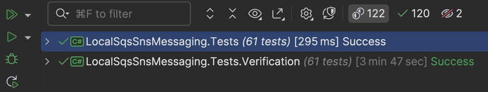

# LocalSqsSnsMessaging

[](https://www.nuget.org/packages/LocalSqsSnsMessaging "Download LocalSqsSnsMessaging from NuGet")
[](https://github.com/justeattakeaway/LocalSqsSnsMessaging/actions/workflows/build.yml)

## Overview

This .NET library is intended to provide a simple in-memory drop-in replacement for the AWS SDK for SQS, SNS and EventBridge, primarily for testing (but can be used for local development too).

It comes in three flavours that all share the same in-memory bus:

- **In-process** (`LocalSqsSnsMessaging` on NuGet) – hand the real AWS SDK clients an in-memory `HttpMessageHandler`, no network involved. This is the fastest option and the one to reach for in tests.
- **In-process for AWS SDK v3** (`LocalSqsSnsMessaging.AWSSDKv3`) – the same library built against the `3.7.x` AWS SDK for codebases that haven't moved to v4 yet.
- **Standalone server** – a small native binary / container that speaks the AWS wire protocols over HTTP, with a dashboard, for local development or non-.NET consumers. See [Standalone server](#standalone-server).

### What's emulated

| Service | Supported |
| --- | --- |
| **SQS** | Standard and FIFO queues, long polling, visibility timeouts, delays, message attributes, batch operations, redrive policies and dead-letter queues, message move tasks (redrive from a DLQ), fair queues (per-message-group deduplication), queue tags. |
| **SNS** | Topics (standard and FIFO), `sqs` and `http`/`https` subscriptions, raw message delivery, [filter policies](#sns-filter-policies) on message attributes or the message body, [HTTP/S delivery](#sns-httphttps-subscriptions) with retry and delivery policies, [subscription dead-letter queues](#sns-subscription-dead-letter-queues), topic attributes, permissions and tags. |
| **EventBridge** | Event buses, rules with [event patterns](https://docs.aws.amazon.com/eventbridge/latest/userguide/eb-event-patterns.html), targets, `PutEvents` routing to SQS targets, input transformers, `TestEventPattern`. See [EventBridge](#eventbridge). |

Operations that don't make sense in memory (SMS, mobile push, platform applications, data protection policies) throw `NotSupportedException`.

## Why?

Why would you build this when LocalStack already exists, and is awesome?

One word: _Speed_ 🏎️️⚡⚡

While LocalStack is relatively quick, nothing is a replacement for in-memory operations, it means you can run your tests faster, and you can run them in parallel without worrying about port conflicts.

Don't take our word for it, here are our tests for this project at the time of writing, ran against this library and LocalStack (to verify correctness):


> [!TIP]
> The LocalStack tests above were ran with the default behaviour of xUnit, which is to not run tests in parallel when a test collection is used.
> You can speed up this sort of test suite by fighting against xUnit's defaults (see [Meziantou.Xunit.ParallelTestFramework](https://github.com/meziantou/Meziantou.Xunit.ParallelTestFramework) for example) and getting tests to run in parallel.
> LocalStack has feature where if you pass an access key that looks like an account id, it will use this account for any resources created, this can help isolate tests from each other allowing them to run in parallel.

Additionally, some tests rely on the passage of time, but now with .NET's [`TimeProvider`](https://learn.microsoft.com/dotnet/api/system.timeprovider) you can control time in your tests, and travel through time like it's 1985, Great Scott!

## Examples

### Basic Usage

Creating a topic, a queue, subscribing the queue to the topic, and sending a message to the topic, then receiving the message from the queue.

```csharp
using Amazon.SimpleNotificationService.Model;
using LocalSqsSnsMessaging;

var bus = new InMemoryAwsBus();
using var sqs = bus.CreateSqsClient();
using var sns = bus.CreateSnsClient();

// Create a queue and a topic
var queueUrl = (await sqs.CreateQueueAsync("test-queue")).QueueUrl;
var topicArn = (await sns.CreateTopicAsync("test-topic")).TopicArn;
var queueArn = (await sqs.GetQueueAttributesAsync(queueUrl, ["QueueArn"])).Attributes["QueueArn"];

// Subscribe the queue to the topic
await sns.SubscribeAsync(new SubscribeRequest(topicArn, "sqs", queueArn)
{
    Attributes = new() { ["RawMessageDelivery"] = "true" }
});

// Send a message to the topic
await sns.PublishAsync(topicArn, "Hello, World!");

// Receive the message from the queue
var receiveMessageResponse = await sqs.ReceiveMessageAsync(queueUrl);
var message = receiveMessageResponse.Messages.Single();

Console.WriteLine(message.Body); // Hello, World!
```

### Time Travel

Creating a queue, sending a message to the queue with a delay, advancing time, and receiving the message from the queue.

```csharp
using Amazon.SQS.Model;
using LocalSqsSnsMessaging;
using Microsoft.Extensions.Time.Testing;

var timeProvider = new FakeTimeProvider(); // From `Microsoft.Extensions.TimeProvider.Testing` package

var bus = new InMemoryAwsBus { TimeProvider = timeProvider};
using var sqs = bus.CreateSqsClient();
using var sns = bus.CreateSnsClient();

// Create a queue
var queueUrl = (await sqs.CreateQueueAsync("test-queue")).QueueUrl;

// Send a message to the topic
await sqs.SendMessageAsync(new SendMessageRequest(queueUrl, "Hello, World!")
{
    DelaySeconds = 30
});

// Receive the message from the queue
var firstReceiveMessageResponse = await sqs.ReceiveMessageAsync(queueUrl);
Console.WriteLine(firstReceiveMessageResponse.Messages.Count); // 0

// Advance time by 31 seconds
timeProvider.Advance(TimeSpan.FromSeconds(31));

// Receive the message from the queue
var secondReceiveMessageResponse = await sqs.ReceiveMessageAsync(queueUrl);
var message = secondReceiveMessageResponse.Messages.Single();

Console.WriteLine(message.Body); // Hello, World!
```

All actions in this library that depend on delays or timeouts use the `TimeProvider` to control time, so you can also take advantage of this feature with features like visibility timeouts.

### SNS filter policies

Subscriptions honour [filter policies](https://docs.aws.amazon.com/sns/latest/dg/sns-subscription-filter-policies.html) on either the message attributes (the default) or, with `FilterPolicyScope` set to `MessageBody`, the JSON message body. The full grammar is supported: exact matches, `anything-but`, `prefix`, `suffix`, `equals-ignore-case`, `numeric` ranges, `exists`, `$or`, and nested keys for body-scoped policies. Invalid policies are rejected with `InvalidParameterException`, as on AWS.

```csharp
await sns.SubscribeAsync(new SubscribeRequest(topicArn, "sqs", queueArn)
{
    Attributes = new()
    {
        ["RawMessageDelivery"] = "true",
        ["FilterPolicyScope"] = "MessageBody",
        ["FilterPolicy"] = """{"order": {"status": ["shipped"], "total": [{"numeric": [">", 100]}]}}"""
    }
});

await sns.PublishAsync(topicArn, """{"order": {"status": "shipped", "total": 250}}"""); // delivered
await sns.PublishAsync(topicArn, """{"order": {"status": "placed",  "total": 250}}"""); // filtered out
```

### SNS HTTP/HTTPS subscriptions

Topics can fan out to `http` and `https` endpoints. The bus POSTs the same thing real SNS does: the `x-amz-sns-message-type`, `x-amz-sns-message-id`, `x-amz-sns-topic-arn` and `x-amz-sns-subscription-arn` headers, and either the JSON `Notification` envelope or, with `RawMessageDelivery`, the bare message plus an `x-amz-sns-rawdelivery: true` header. Subscribing sends a `SubscriptionConfirmation` message to the endpoint so handlers that expect the handshake still see it; the subscription is confirmed straight away, and `ConfirmSubscription` accepts the token from that message.

Delivery happens in the background. Endpoints that return `5xx` or `429`, or can't be reached, are retried according to the subscription's (or topic's) `DeliveryPolicy`; the defaults are the AWS defaults of three retries twenty seconds apart. Any other error is a permanent failure. The delays use the bus's `TimeProvider`, so in tests you can advance a `FakeTimeProvider` instead of waiting.

Set `InMemoryAwsBus.HttpClient` to control where those requests go, for example an ASP.NET Core `TestServer` client or a fake `HttpMessageHandler`:

```csharp
var bus = new InMemoryAwsBus { HttpClient = webApplicationFactory.CreateClient() };
using var sns = bus.CreateSnsClient();

await sns.SubscribeAsync(new SubscribeRequest(topicArn, "https", "https://localhost/webhooks/orders")
{
    Attributes = new()
    {
        ["DeliveryPolicy"] = """{"healthyRetryPolicy": {"numRetries": 5, "minDelayTarget": 1, "maxDelayTarget": 30, "backoffFunction": "exponential"}}"""
    }
});
```

### SNS subscription dead-letter queues

Attach a `RedrivePolicy` to a subscription and anything that can't be delivered lands in that SQS queue: HTTP/S endpoints that exhaust their retries or return a client error, and SQS subscriptions whose queue has since been deleted. The dead-lettered message is exactly what the endpoint would have received (the SNS envelope, or the raw body for raw subscriptions).

```csharp
await sns.SubscribeAsync(new SubscribeRequest(topicArn, "https", "https://localhost/webhooks/orders")
{
    Attributes = new()
    {
        ["RedrivePolicy"] = $$"""{"deadLetterTargetArn": "{{dlqArn}}"}"""
    }
});
```

### EventBridge

The bus also emulates EventBridge, which is enough to test code built on [AWS.Messaging](https://github.com/awslabs/aws-dotnet-messaging) or anything else that publishes events and consumes them from SQS. Rules match on the full [event pattern grammar](https://docs.aws.amazon.com/eventbridge/latest/userguide/eb-event-patterns.html); matched events are delivered to SQS targets (other target types are accepted but skipped), with support for `Input`, `InputPath` and `InputTransformer`.

```csharp
using Amazon.EventBridge.Model;

var bus = new InMemoryAwsBus();
using var events = bus.CreateEventBridgeClient();
using var sqs = bus.CreateSqsClient();

var queueUrl = (await sqs.CreateQueueAsync("order-events")).QueueUrl;
var queueArn = (await sqs.GetQueueAttributesAsync(queueUrl, ["QueueArn"])).Attributes["QueueArn"];

await events.PutRuleAsync(new PutRuleRequest
{
    Name = "orders-placed",
    EventPattern = """{"source": ["my.orders"], "detail-type": ["OrderPlaced"]}"""
});
await events.PutTargetsAsync(new PutTargetsRequest
{
    Rule = "orders-placed",
    Targets = [new Target { Id = "queue", Arn = queueArn }]
});

await events.PutEventsAsync(new PutEventsRequest
{
    Entries = [new PutEventsRequestEntry
    {
        Source = "my.orders",
        DetailType = "OrderPlaced",
        Detail = """{"orderId": 42}"""
    }]
});

var message = (await sqs.ReceiveMessageAsync(queueUrl)).Messages.Single();
Console.WriteLine(message.Body); // the EventBridge envelope: {"version":"0","id":...,"detail":{"orderId":42}}
```

### Integrating with an existing `HttpClientFactory`

When integration-testing an application that registers its own `Amazon.Runtime.HttpClientFactory`
in DI (for example, one that delegates to `IHttpClientFactory` for all AWS SDK clients), use
`InMemoryAwsHttpClientFactory` to intercept only the services backed by the in-memory bus and let
the rest reach their real endpoints:

```csharp
using LocalSqsSnsMessaging;
using LocalSqsSnsMessaging.Http;

var bus = new InMemoryAwsBus();

// In your test's DI setup, replace the application's HttpClientFactory.
// The fallback is a one-liner — adapt it to whatever pipeline the app uses.
services.AddSingleton<Amazon.Runtime.HttpClientFactory>(sp =>
    bus.CreateAwsHttpClientFactory(cfg =>
        sp.GetRequiredService<IHttpClientFactory>().CreateClient(cfg.GetType().Name)));
```

For full control you can also construct the handler directly:

```csharp
var handler = new InMemoryAwsHttpMessageHandler(bus, AwsServiceType.Sqs);
var client = new HttpClient(handler);
```

## Standalone server

If you'd rather run something out of process, for example for a non-.NET service or to poke at queues by hand, the same bus is available as a small HTTP server that speaks the SQS, SNS and EventBridge wire protocols. Point any AWS SDK at it with `ServiceURL = "http://localhost:5050"` and fake credentials.

Run it with Docker:

```bash
docker run --rm -p 5050:5050 ghcr.io/justeattakeaway/local-sqs-sns
```

or grab a native binary for your platform from the [GitHub releases](https://github.com/justeattakeaway/LocalSqsSnsMessaging/releases) (`local-sqs-sns-<rid>.tar.gz` / `.zip`), or run it from source:

```bash
dotnet run --project src/LocalSqsSnsMessaging.Server -- --port 5050 --region us-east-1 --account-id 000000000000
```

| Option | Default | Description |
| --- | --- | --- |
| `--port` | `5050` | Port to listen on. Queue URLs are generated with this base address. |
| `--region` | `us-east-1` | Region used in generated ARNs. |
| `--account-id` | `000000000000` | The default account. |

The server is multi-account: if the access key ID in a request's `Authorization` header is a 12-digit number, that account gets its own isolated bus, created on first use. This mirrors the LocalStack convention and lets parallel test runs share one server without seeing each other's queues.

### Dashboard

The server hosts a dashboard at `http://localhost:5050/_ui` that updates live as your application runs. It shows every queue, topic and subscription for the selected account with a graph of how they're wired together, lets you peek at pending and in-flight messages, delete or redrive them, publish a message to a topic, and shows a feed of recent API calls so you can see exactly which operations your code made.
